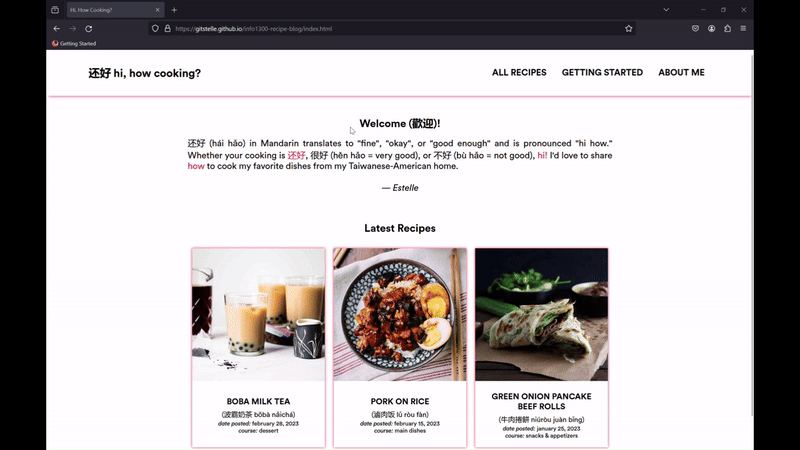

# [还好 Hi, How Cooking?](https://gitstelle.github.io/info1300-recipe-blog/index.html)

This was a project for INFO 1300: Introductory Design and Programming for the Web, in which we were tasked to make a personal website implement interactivity using jQuery.

I chose to make a Taiwanese American cooking blog called "还好 Hi, How Cooking?" "还好" can be phonetically read as "hi how" and translates to "just fine" or "okay."

These recipes and guides in the blog were NOT actually written by me! They are from cooking blogs that I do follow, and the content was used here for the purposes of educating myself in web design for this class. The recipes are properly credited in the website and also be found here:

- [Boba Milk Tea](https://healthynibblesandbits.com/how-to-make-bubble-tea/) from Healthy Nibbles
- [Pork on Rice](https://thewoksoflife.com/lu-rou-fan-taiwanese-braised-pork-rice-bowl/) by The Woks of Life
- [Green Onion Pancake Beef Rolls](https://www.goodiesavolonte.com/2013/11/17/chinese-beef-rolls/) by Goodies a' Volonte
- [Start Your Chinese Pantry with 10 Essential Ingredients](https://thewoksoflife.com/chinese-pantry-essential-ingredients/) by The Woks of Life

The website submitted for this class can be found [here.](https://gitstelle.github.io/info1300-recipe-blog/index.html)

## License
[MIT License](https://opensource.org/license/mit/)